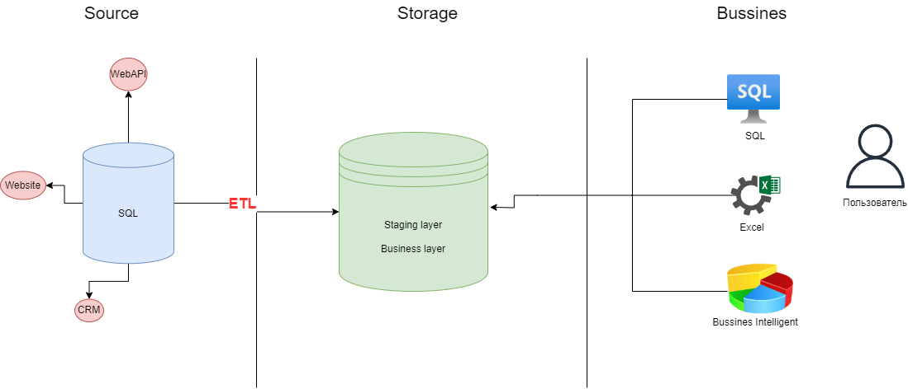

# Домашнее задание для модуля 1

## 1.1 Архитектура аналитического решения
Архитектура аналитического решения торговой сети «Superstore» имеет 3 уровня:
- ***Source Layer*** — слой источников данных. 
> Данные собираются из различных источников (API сайта, промежуточной БД, системы CRM) с помощью ETL/ELT процессов.
- ***Storage Layer*** — слой хранения данных.
> Хранилище данных.
- ***Business Layer*** — слой для доступа к данным.
> Данные целевой аудитории — бизнес клиентов, аналитиков.

